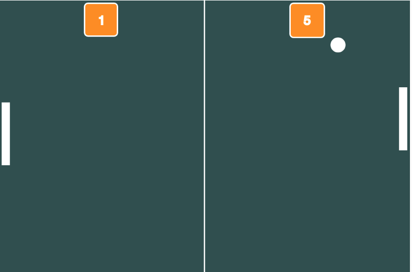
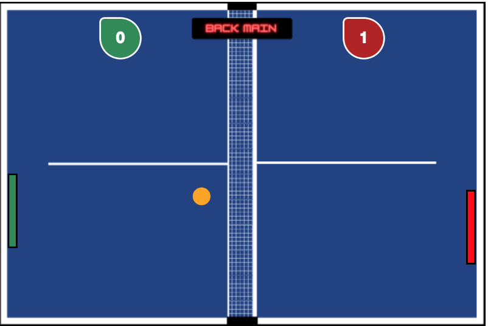
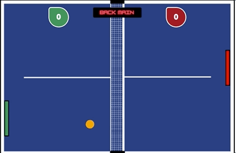
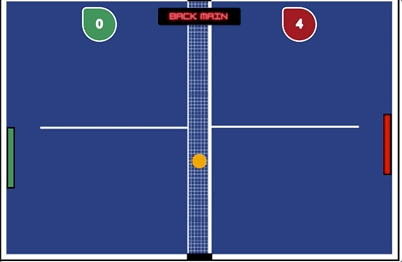

# Game Pong Ball 2.0.js
<h2>My version about the classic game Pong Ball</h2>

## Project description

After completing the Game Classic Pong Ball project with Alura's teacher, with my acquired knowledge and internet research, I created my version of the game.

I decided to include an interactive menu giving two game options, against artificial intelligence or Multiplayer mode. In addition to creating a visual for the main menu

I recreated the game design making it more attractive and beautiful, a theme song, racket contact sounds and punctuation sounds.

# What has changed?

The entire look of the board has been redone, bringing more eye-catching colors, a more realistic table and ball, and a new face on the scoreboard.

<h1>
 Before

<h1>
 After

## New mode game

In the original project, it is only possible to play against AI, so it includes an interactive menu with one more game option, Multiplayer, you and a friend can play together and challenge each other. The player on the left uses the mouse to move the green racket and the player on the right uses the "W" (up) and "S" (down) keys to move the red racket.

## Inclusion of objective

In the old version, the game continues without end and without maximum points, making it unattractive. In this version, the first player to score 5 points wins and the game ends with a winner or loser message.

In this link below access to the project ending being able to interact and have fun with the game Pong Ball by Dev Zilio:

https://editor.p5js.org/DevZilio/full/0tumxbYbX

or if you want to check the code directly on the p5js.org platform, access the link below:

https://editor.p5js.org/DevZilio/sketches/0tumxbYbX

Original version Pong Ball (by DevZilio)
https://github.com/DevZilio/Game_Classic_Pong.js.git

# Conclusion

Nesse projeto foi possivel entender como trabalhar com multitelas, reaproveitar codigos para mais de uma funcao sem quebrar o jogo, incluir acoes com clique de mouse, menu interativo e objetivo para o jogo, foi um grande desafio que foi concluido. 

Estou contente com o resultado do meu primeiro projeto realizado sozinho apos aprender o basico de JavaScript e sigo neste caminho para que venha outros mais.

## Author

[ DevZilio](https://github.com/DevZilio)